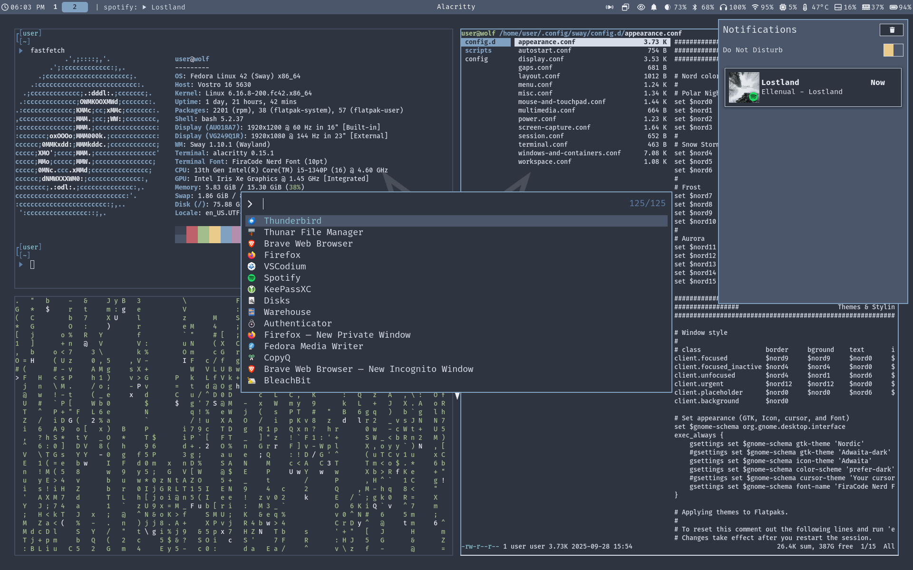

<h3 align="center">
    
</h3>

<div align="center">
  <a href="https://github.com/hafiz-muhammad/configs/wiki"><strong>Wiki</strong></a>
  &nbsp;&nbsp;
  <a href="https://github.com/hafiz-muhammad/configs#-repository-tree-"><strong>Repo Tree</strong></a>
</div>

> [!NOTE]
> Configurations for things that I am no longer using can be found in the [archive](https://github.com/hafiz-muhammad/configs/tree/archive) branch.

<br>
<br>

<h2 align="center">📸 Screenshots 📸</h2>

| Fedora Sway Spin w/ Nord color scheme                                                                                                   |
|:---------------------------------------------------------------------------------------------------------------------------------------:|
|                                                                               |

---

## Linux

### Fedora Sway Spin:

### 📚 Resources 

<details><summary>Documentation</summary>

- [Sway Wiki](https://github.com/swaywm/sway/wiki)
- [Sway - ArchWiki](https://wiki.archlinux.org/title/Sway)
- [Fedora Documentation](https://docs.fedoraproject.org/en-US/docs/)
</details>

### 💾 Software & 🎨 Customization

<details><summary>Main/Essential</summary>

- [alacritty](https://github.com/alacritty/alacritty) - Terminal emulator.
- [thunar](https://packages.fedoraproject.org/pkgs/Thunar/Thunar/) - File manager.
- [blueman](https://packages.fedoraproject.org/pkgs/blueman/blueman/) - A tool to use Bluetooth devices. 
- [cups](https://packages.fedoraproject.org/pkgs/cups/cups/) - Print manager for Linux.
- [git](https://packages.fedoraproject.org/pkgs/git/git/) - Distributed revision control system.
- [python3-pip](https://packages.fedoraproject.org/pkgs/python-pip/python3-pip/) - A tool for installing and managing Python3 packages.
- [imv](https://packages.fedoraproject.org/pkgs/imv/imv/) - Image viewer for X11 and Wayland.
- [autotiling](https://github.com/nwg-piotr/autotiling) - Script for sway and i3 to automatically switch the horizontal & vertical window split orientation.
- [NetworkManager](https://packages.fedoraproject.org/pkgs/NetworkManager/NetworkManager/) - NetworkManager is a system service that manages network interfaces and connections.
- [nm-connection-editor](https://rpmfind.net/linux/rpm2html/search.php?query=nm-connection-editor&submit=Search+...&system=&arch=) - A network connection configuration editor for NetworkManager.
- [network-manager-applet](https://packages.fedoraproject.org/pkgs/network-manager-applet/network-manager-applet/) - Network control and status notification area applet for use with NetworkManager.
- [pipewire](https://packages.fedoraproject.org/pkgs/pipewire/pipewire/) - A multimedia server for Linux and other Unix like operating systems.
- [pipewire-alsa](https://packages.fedoraproject.org/pkgs/pipewire/pipewire-alsa/) - An ALSA plugin for the PipeWire media server.
- [ffmpeg-free](https://packages.fedoraproject.org/pkgs/ffmpeg/ffmpeg-free/) - A multimedia framework to record, convert and stream audio and video.
- [nodejs](https://packages.fedoraproject.org/pkgs/nodejs22/nodejs/) - JavaScript runtime.
- [waybar](https://packages.fedoraproject.org/pkgs/waybar/waybar/) -  Status bar for Sway and Wlroots based compositors.
- [swaylock](https://packages.fedoraproject.org/pkgs/swaylock/swaylock/) - Lockscreen for Wayland compositors.
- [swaybg](https://packages.fedoraproject.org/pkgs/swaybg/swaybg/) - Wallpaper tool for Wayland compositors.
- [light](https://packages.fedoraproject.org/pkgs/light/light/) - Light is a program to control backlight.
- [fuzzel](https://packages.fedoraproject.org/pkgs/fuzzel/fuzzel/) - Wayland-native application launcher and fuzzy finder, inspired by rofi and dmenu.
- ~~[bemenu](https://packages.fedoraproject.org/pkgs/bemenu/bemenu/) - Dynamic menu inspired by dmenu.~~
- [wlogout](https://packages.fedoraproject.org/pkgs/wlogout/wlogout/) - A wayland based logout menu.
- [wdisplays](https://packages.fedoraproject.org/pkgs/wdisplays/wdisplays/) - A graphical application for configuring displays in Wayland compositors. 
- [wlroots](https://packages.fedoraproject.org/pkgs/wlroots/wlroots/) - A modular Wayland compositor library.
- [wf-recorder](https://packages.fedoraproject.org/pkgs/wf-recorder/wf-recorder/) - Screen recording utility for of wlroots-based compositors that support wlr-screencopy-v1 and xdg-output. 
- [grim](https://packages.fedoraproject.org/pkgs/grim/grim/) - Command-line tool to grab images from Sway. 
- [grimshot](https://packages.fedoraproject.org/pkgs/sway-contrib/grimshot/) - Screenshot utility for sway.
- [slurp](https://packages.fedoraproject.org/pkgs/slurp/slurp/) - Command-line tool that allows you to select a region on the screen and prints it to the standard output.
- [wl-clipboard](https://packages.fedoraproject.org/pkgs/wl-clipboard/wl-clipboard/) - Command-line Wayland clipboard utilities, `wl-copy` and `wl-paste`.
- [swaync](https://github.com/ErikReider/SwayNotificationCenter) - A notification daemon for SwayWM.
- [copyq](https://packages.fedoraproject.org/pkgs/copyq/copyq/) - Graphical clipboard manager.
- [NetworkManager-tui](https://packages.fedoraproject.org/pkgs/NetworkManager/NetworkManager-tui/) - NetworkManager-tui provides a text-based user interface for managing network connections in a non-graphical environment.
- [tuned](https://packages.fedoraproject.org/pkgs/tuned/tuned/) - A dynamic adaptive system tuning daemon.
- [tuned-ppd](https://packages.fedoraproject.org/pkgs/tuned/tuned-ppd/) - power-profiles-daemon compatibility daemon.
</details>

<details><summary>Web Browsers</summary>

- [firefox](https://packages.fedoraproject.org/pkgs/firefox/firefox/) - A free and open source web browser by Mozilla.
- [Brave](https://brave.com/) - A free and open source Chromium web browser by Brave Software. 
</details>

<details><summary>Text Editors & IDEs</summary>

- [helix](https://packages.fedoraproject.org/pkgs/helix/helix/) - A post-modern modal text editor written in Rust.
- [Text Editor](https://flathub.org/apps/org.gnome.TextEditor) - Text editor for the GNOME desktop environment.
- [VSCodium](https://vscodium.com/) - A version of Visual Studio Code without telemetry.
</details>

<details><summary>Customization</summary>

- [Nerd Fonts](https://www.nerdfonts.com/) - Iconic font aggregator, collection, and patcher.
  - Nerd Font used: FiraCode Nerd Font

<blockquote>
  <strong>Note:</strong> Nerd Font icons are used.
</blockquote>

- [Embellish](https://flathub.org/en/apps/io.github.getnf.embellish) - An application for managing Nerd Fonts.
- [Oh My Posh](https://ohmyposh.dev/) - A prompt theme engine for any shell.
- [Oh My Posh nordtron theme](https://github.com/JanDeDobbeleer/oh-my-posh/blob/main/themes/nordtron.omp.json)
- [adwaita-icon-theme](https://github.com/GNOME/adwaita-icon-theme) - Icon set for GNOME core apps.
- [gnome-themes-extra](https://packages.fedoraproject.org/pkgs/gnome-themes-extra/gnome-themes-extra/) - This module houses themes and theme-y tidbits that don’t really fit in anywhere
else, or deserve their own module.
</details>

<details><summary>Optimization</summary>

- [profile-sync-daemon](https://packages.fedoraproject.org/pkgs/profile-sync-daemon/profile-sync-daemon/) - Symlinks and syncs browser profile dirs to RAM thus reducing HDD/SDD calls and speeding-up browsers.
</details>

<details><summary>System Monitoring and Information</summary>

- [fastfetch](https://packages.fedoraproject.org/pkgs/fastfetch/fastfetch/) - A neofetch like system information tool.
- [htop](https://packages.fedoraproject.org/pkgs/htop/htop/) - An interactive process viewer.     
- [nmon](https://packages.fedoraproject.org/pkgs/nmon/nmon/) - A systems administrator, tuner, benchmark tool, which provides information about CPU, disks, network, etc.
- [lm_sensors](https://packages.fedoraproject.org/pkgs/lm_sensors/lm_sensors/) - A collection of modules for general SMBus access and hardware monitoring.
- [collectl](https://packages.fedoraproject.org/pkgs/collectl/collectl/) - A utility to collect Linux performance data.
- [smartmontools](https://packages.fedoraproject.org/pkgs/smartmontools/smartmontools/) - a set of utility programs to control and monitor computer storage systems using the Self-Monitoring, Analysis and Reporting Technology system built into most modernATA, Serial ATA, SCSI/SAS and NVMe hard drives.
- [nvme-cli](https://packages.fedoraproject.org/pkgs/nvme-cli/nvme-cli/) - Provides NVM-Express user space tooling for Linux.
- [macchanger](https://packages.fedoraproject.org/pkgs/macchanger/macchanger/) - A utility to viewing & manipulating the MAC address of network interfaces.
</details>

<details><summary>Security</summary>

- [firewalld](https://packages.fedoraproject.org/pkgs/firewalld/firewalld/) - A firewall service daemon that provides a dynamic customizable firewall with a D-Bus interface.
- [firewall-config](https://packages.fedoraproject.org/pkgs/firewalld/firewall-config/) - Firewall configuration application provides an configuration interface for
firewalld.
- [clamav](https://packages.fedoraproject.org/pkgs/clamav/clamav/) - An open source antivirus engine for detecting trojans, viruses, malware & other malicious threats.
- [chkrootkit](https://packages.fedoraproject.org/pkgs/chkrootkit/chkrootkit/) - A tool to locally check for signs of a rootkit.
- [lynis](https://packages.fedoraproject.org/pkgs/lynis/lynis/) - An auditing and hardening tool for Unix/Linux. Performs many individual security control checks. Detects security issues and provides suggestions to improve the security defense of the system.
- [rkhunter](https://packages.fedoraproject.org/pkgs/rkhunter/rkhunter/) - Rootkit Hunter, security monitoring and analyzing tool.
- [fail2ban](https://packages.fedoraproject.org/pkgs/fail2ban/fail2ban/) - Scans log files and bans IP addresses that makes too many password failures. It updates firewall rules to reject the IP address. These rules can be defined by the user.
- [firejail](https://packages.fedoraproject.org/pkgs/firejail/firejail/) - A SUID sandbox program that reduces the risk of security breaches by restricting the running environment of untrusted applications using Linux namespaces.
</details>

<details><summary>Other</summary>

- [mediawriter](https://packages.fedoraproject.org/pkgs/mediawriter/mediawriter/) - A tool to write images of Fedora media to portable drives.
- [gparted](https://packages.fedoraproject.org/pkgs/gparted/gparted/) - A graphical partition manager.
- [Warehouse](https://flathub.org/apps/io.github.flattool.Warehouse) - A UI to manage Flatpaks.
- [AppImageLauncher](https://github.com/TheAssassin/AppImageLauncher) - Linux helper application for running and integrating AppImages.
- [Gear Lever](https://flathub.org/apps/it.mijorus.gearlever) - A utility to manage AppImages.
- [KeePassXC](https://flathub.org/apps/org.keepassxc.KeePassXC) - A secure free and open source cross-platform password manager.
- [Syncthing](https://packages.fedoraproject.org/pkgs/syncthing/syncthing/) - Free and open source peer-to-peer file synchronization application.
- [Seahorse/Passwords and Keys](https://flathub.org/apps/org.gnome.seahorse.Application) - Manage encryption keys. A keyring manager.
- [Authenticator](https://flathub.org/apps/details/com.belmoussaoui.Authenticator) - Am application for generating Two-Factor Authentication Codes.
- [gnome-keyring](https://packages.fedoraproject.org/pkgs/gnome-keyring/gnome-keyring/) - A daemon for managings passwords and other types of secrets for the user, storing them encrypted with a main password. Applications can use the gnome-keyring library to integrate with the keyring.
- [Thunderbird](https://flathub.org/apps/org.mozilla.Thunderbird) - Free and open source email client.
- [BleachBit](https://flathub.org/apps/org.bleachbit.BleachBit) - Cleans files to free disk space and to maintain privacy.
- [file-roller](https://packages.fedoraproject.org/pkgs/file-roller/file-roller/) - An application for creating and viewing archives files.
- [LibreOffice](https://flathub.org/apps/org.libreoffice.LibreOffice) - Free and Open Source office suite.
- [VLC](https://flathub.org/en/apps/org.videolan.VLC) - A free and open source cross-platform multimedia player.
</details>

## Windows

### 💾 Software

<details><summary>Applications Used</summary>
    
- [O&O ShutUp10++](https://www.oo-software.com/en/shutup10)
- [Microsoft PowerToys](https://apps.microsoft.com/detail/xp89dcgq3k6vld?hl=en-US&gl=US)
- [Windows Terminal](https://apps.microsoft.com/detail/9n0dx20hk701?hl=en-US&gl=US)
</details>

---

<!-- Always keep repository tree section at the bottom of the README -->
<h2 align="center">🌳 Repository Tree 🌳</h2>

> [!NOTE]
> The tree below shows the current structure of the `main` branch.

<!-- BEGIN REPOSITORY TREE -->
```
    ├── .gitattributes
    ├── .gitconfig
    ├── .github
    │   ├── scripts
    │   │   └── update-readme-tree.sh
    │   └── workflows
    │       ├── update-readme-tree.yml
    │       └── update-windows-hosts-file.yml
    ├── .gitignore
    ├── README.md
    ├── assets
    │   ├── images
    │   │   └── banner.png
    │   └── screenshots
    │       └── sway-nord.png
    ├── helix
    │   ├── config.toml
    │   └── themes
    │       ├── default_transparent.toml
    │       ├── gruvbox_transparent.toml
    │       └── nord_transparent.toml
    ├── linux
    │   ├── home
    │   │   ├── .bashrc.d
    │   │   │   ├── bash-aliases.bashrc
    │   │   │   ├── cups-aliases.bashrc
    │   │   │   ├── dnf-aliases.bashrc
    │   │   │   ├── environment.bashrc
    │   │   │   ├── filesystem-aliases.bashrc
    │   │   │   ├── firmware-aliases.bashrc
    │   │   │   ├── flatpak-aliases.bashrc
    │   │   │   ├── flatpak-dir-to-path.bashrc
    │   │   │   ├── functions.bashrc
    │   │   │   ├── general-aliases.bashrc
    │   │   │   ├── git-aliases.bashrc
    │   │   │   ├── go.bashrc
    │   │   │   ├── grub-aliases.bashrc
    │   │   │   ├── history.bashrc
    │   │   │   ├── networking-aliases.bashrc
    │   │   │   ├── oh-my-posh.bashrc
    │   │   │   ├── power-management-aliases.bashrc
    │   │   │   ├── sway-aliases.bashrc
    │   │   │   └── weather-aliases.bashrc
    │   │   ├── .config
    │   │   │   ├── alacritty
    │   │   │   │   ├── alacritty.toml
    │   │   │   │   └── themes
    │   │   │   │       ├── gruvbox_dark.toml
    │   │   │   │       ├── inferno.toml
    │   │   │   │       ├── midnight_haze.toml
    │   │   │   │       └── nord.toml
    │   │   │   ├── fastfetch
    │   │   │   │   └── config.jsonc
    │   │   │   └── htop
    │   │   │       └── htoprc
    │   │   ├── .local
    │   │   │   └── bin
    │   │   │       └── alacritty-pick
    │   │   └── .npmrc
    │   └── sway
    │       ├── etc
    │       │   └── environment
    │       └── home
    │           ├── .bash_profile
    │           ├── .bashrc
    │           ├── .config
    │           │   ├── fuzzel
    │           │   │   └── fuzzel.ini
    │           │   ├── gtk-3.0
    │           │   │   └── gtk.css
    │           │   ├── gtk-4.0
    │           │   │   └── gtk.css
    │           │   ├── sway
    │           │   │   ├── config
    │           │   │   ├── config.d
    │           │   │   │   ├── appearance.conf
    │           │   │   │   ├── autostart.conf
    │           │   │   │   ├── display.conf
    │           │   │   │   ├── gaps.conf
    │           │   │   │   ├── layout.conf
    │           │   │   │   ├── menu.conf
    │           │   │   │   ├── misc.conf
    │           │   │   │   ├── mouse-and-touchpad.conf
    │           │   │   │   ├── multimedia.conf
    │           │   │   │   ├── power.conf
    │           │   │   │   ├── screen-capture.conf
    │           │   │   │   ├── session.conf
    │           │   │   │   ├── terminal.conf
    │           │   │   │   ├── windows-and-containers.conf
    │           │   │   │   └── workspace.conf
    │           │   │   └── scripts
    │           │   │       └── laptop-lid.sh
    │           │   ├── swaylock
    │           │   │   └── config
    │           │   ├── swaync
    │           │   │   ├── config.json
    │           │   │   ├── style.css
    │           │   │   └── styling
    │           │   │       ├── _color-scheme.scss
    │           │   │       ├── _control-center.scss
    │           │   │       ├── _notification.scss
    │           │   │       ├── _widget-dnd.scss
    │           │   │       ├── _widget-menubar.scss
    │           │   │       └── _widget-title.scss
    │           │   ├── waybar
    │           │   │   ├── bar-config.jsonc
    │           │   │   ├── config.jsonc
    │           │   │   ├── modules
    │           │   │   │   ├── backlight.jsonc
    │           │   │   │   ├── battery.jsonc
    │           │   │   │   ├── bluetooth.jsonc
    │           │   │   │   ├── clock.jsonc
    │           │   │   │   ├── cpu.jsonc
    │           │   │   │   ├── custom.jsonc
    │           │   │   │   ├── disk.jsonc
    │           │   │   │   ├── idle-inhibitor.jsonc
    │           │   │   │   ├── memory.jsonc
    │           │   │   │   ├── mpris.jsonc
    │           │   │   │   ├── network.jsonc
    │           │   │   │   ├── privacy.jsonc
    │           │   │   │   ├── pulseaudio.jsonc
    │           │   │   │   ├── sway.jsonc
    │           │   │   │   └── temperature.jsonc
    │           │   │   ├── style.css
    │           │   │   └── styling
    │           │   │       ├── _backlight.scss
    │           │   │       ├── _battery.scss
    │           │   │       ├── _bluetooth.scss
    │           │   │       ├── _clock.scss
    │           │   │       ├── _color-scheme.scss
    │           │   │       ├── _cpu.scss
    │           │   │       ├── _disk.scss
    │           │   │       ├── _global.scss
    │           │   │       ├── _idle-inhibitor.scss
    │           │   │       ├── _memory.scss
    │           │   │       ├── _modules.scss
    │           │   │       ├── _mpris.scss
    │           │   │       ├── _network.scss
    │           │   │       ├── _notifications.scss
    │           │   │       ├── _privacy.scss
    │           │   │       ├── _pulseaudio.scss
    │           │   │       ├── _scratchpad.scss
    │           │   │       ├── _temperature.scss
    │           │   │       ├── _tooltip.scss
    │           │   │       ├── _window.scss
    │           │   │       └── _workspaces.scss
    │           │   └── wlogout
    │           │       ├── layout
    │           │       ├── style.css
    │           │       └── styling
    │           │           ├── _button.scss
    │           │           ├── _colors-scheme.scss
    │           │           ├── _global.scss
    │           │           ├── _hibernate.scss
    │           │           ├── _lock.scss
    │           │           ├── _logout.scss
    │           │           ├── _reboot.scss
    │           │           ├── _shutdown.scss
    │           │           ├── _suspend.scss
    │           │           ├── _window.scss
    │           │           └── icons
    │           │               └── nord
    │           │                   ├── INFO.md
    │           │                   ├── hibernate.png
    │           │                   ├── lock.png
    │           │                   ├── logout.png
    │           │                   ├── reboot.png
    │           │                   ├── shutdown.png
    │           │                   └── suspend.png
    │           └── .local
    │               └── bin
    │                   └── toggle-hide-cursor
    └── windows
        ├── Documents
        │   ├── PowerToys
        │   │   └── Backup
        │   │       └── settings_133852382418700222.ptb
        │   └── ooshutup10.cfg
        ├── System32
        │   └── drivers
        │       └── etc
        │           └── hosts
        └── Users
            └── username
                └── AppData
                    └── Local
                        └── Packages
                            └── Microsoft.WindowsTerminal_8wekyb3d8bbwe
                                └── LocalState
                                    └── settings.json
    
    55 directories, 136 files
```
<!-- END REPOSITORY TREE -->
