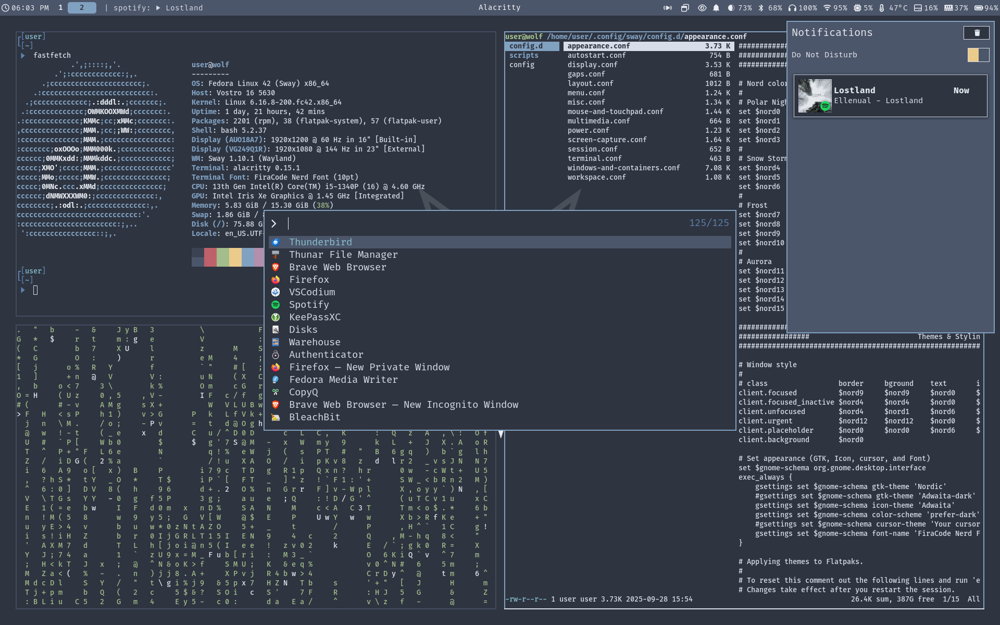
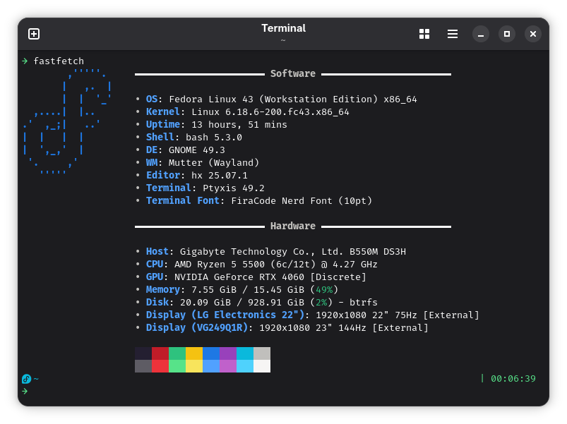
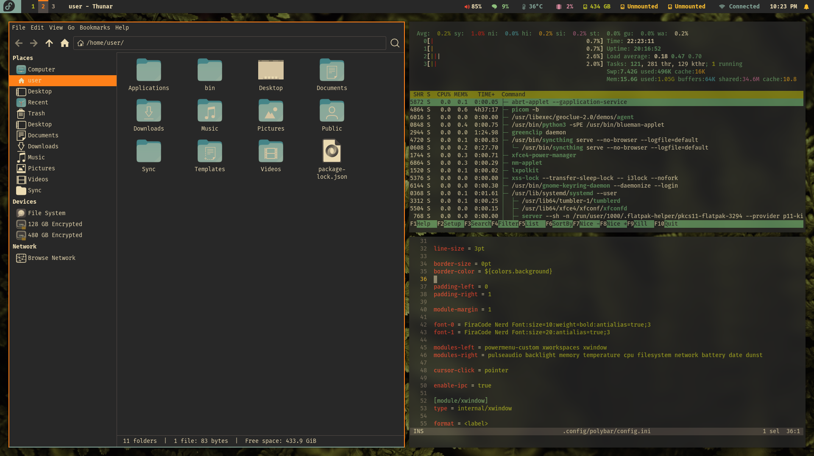
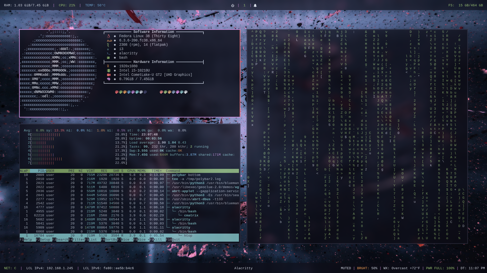

  <h1>My Personal Configs</h1>
  <h3>Dotfiles, documentation, and various other configurations...</h3>

 

## Showcase

<table width="100%">
  <tr>
    <th align="center" width="50%">Fedora Sway Spin (Nord)</th>
    <th align="center" width="50%">Fastfetch</th>
  </tr>
  <tr>
    <td align="center"></td>
    <td align="center"></td>
  </tr>
  <tr>
    <td colspan="2" align="center" style="background-color: #161b22; padding: 10px 0;"><strong>👇 Archived 👇</strong></td>
  </tr>
  <tr>
    <th align="center">Fedora i3 Spin (Gruvbox)</th>
    <th align="center">Fedora i3 Spin (Midnight Haze)</th>
  </tr>
  <tr>
    <td align="center"></td>
    <td align="center"></td>
  </tr>
</table>

## Fedora

Documentation

- [Fedora Documentation](https://docs.fedoraproject.org/en-US/docs/)

### Cross-device

Essential

- [git](https://packages.fedoraproject.org/pkgs/git/git/) - Distributed revision control system.
- [git-lfs](https://packages.fedoraproject.org/pkgs/git-lfs/git-lfs/) - Replaces large files with text pointers inside Git while storing contents on a remote server.
- [nodejs](https://packages.fedoraproject.org/pkgs/nodejs22/nodejs/) - JavaScript runtime.
- [python3-pip](https://packages.fedoraproject.org/pkgs/python-pip/python3-pip/) - A tool for installing and managing Python3 packages.
- [remove-retired-packages](https://packages.fedoraproject.org/pkgs/fedora-upgrade/remove-retired-packages/) - Remove retired distribution's packages.

Web Browsers

- [firefox](https://packages.fedoraproject.org/pkgs/firefox/firefox/) - A free and open source web browser by Mozilla.
- [Brave](https://brave.com/) - A free and open source Chromium web browser by Brave Software. 

Customization

- [Nerd Fonts](https://www.nerdfonts.com/) - Iconic font aggregator, collection, and patcher.
  - Nerd Font used: FiraCode Nerd Font
- [Embellish](https://flathub.org/en/apps/io.github.getnf.embellish) - An application for managing Nerd Fonts.
- [Oh My Posh](https://ohmyposh.dev/) - A prompt theme engine for any shell.

Text Editors & IDEs

- [helix](https://packages.fedoraproject.org/pkgs/helix/helix/) - A post-modern modal text editor written in Rust.
- [Text Editor](https://flathub.org/apps/org.gnome.TextEditor) - Text editor for the GNOME desktop environment.
- [VSCode](https://code.visualstudio.com/) - An integrated development environment developed by Microsoft.

System Monitoring and Information

- [fastfetch](https://packages.fedoraproject.org/pkgs/fastfetch/fastfetch/) - A neofetch like system information tool.
- [htop](https://packages.fedoraproject.org/pkgs/htop/htop/) - An interactive process viewer.     
- [nmon](https://packages.fedoraproject.org/pkgs/nmon/nmon/) - A systems administrator, tuner, benchmark tool, which provides information about CPU, disks, network, etc.
- [lm_sensors](https://packages.fedoraproject.org/pkgs/lm_sensors/lm_sensors/) - A collection of modules for general SMBus access and hardware monitoring.
- [collectl](https://packages.fedoraproject.org/pkgs/collectl/collectl/) - A utility to collect Linux performance data.
- [smartmontools](https://packages.fedoraproject.org/pkgs/smartmontools/smartmontools/) - a set of utility programs to control and monitor computer storage systems using the Self-Monitoring, Analysis and Reporting Technology system built into most modernATA, Serial ATA, SCSI/SAS and NVMe hard drives.
- [nvme-cli](https://packages.fedoraproject.org/pkgs/nvme-cli/nvme-cli/) - Provides NVM-Express user space tooling for Linux.
- [macchanger](https://packages.fedoraproject.org/pkgs/macchanger/macchanger/) - A utility to viewing & manipulating the MAC address of network interfaces.

Optimization

- [profile-sync-daemon](https://packages.fedoraproject.org/pkgs/profile-sync-daemon/profile-sync-daemon/) - Symlinks and syncs browser profile dirs to RAM thus reducing HDD/SDD calls and speeding-up browsers.

Security

- [firewalld](https://packages.fedoraproject.org/pkgs/firewalld/firewalld/) - A firewall service daemon that provides a dynamic customizable firewall with a D-Bus interface.
- [firewall-config](https://packages.fedoraproject.org/pkgs/firewalld/firewall-config/) - Firewall configuration application provides an configuration interface for
firewalld.
- [clamav](https://packages.fedoraproject.org/pkgs/clamav/clamav/) - An open source antivirus engine for detecting trojans, viruses, malware & other malicious threats.
- [chkrootkit](https://packages.fedoraproject.org/pkgs/chkrootkit/chkrootkit/) - A tool to locally check for signs of a rootkit.
- [lynis](https://packages.fedoraproject.org/pkgs/lynis/lynis/) - An auditing and hardening tool for Unix/Linux. Performs many individual security control checks. Detects security issues and provides suggestions to improve the security defense of the system.
- [rkhunter](https://packages.fedoraproject.org/pkgs/rkhunter/rkhunter/) - Rootkit Hunter, security monitoring and analyzing tool.
- [fail2ban](https://packages.fedoraproject.org/pkgs/fail2ban/fail2ban/) - Scans log files and bans IP addresses that makes too many password failures. It updates firewall rules to reject the IP address. These rules can be defined by the user.
- [firejail](https://packages.fedoraproject.org/pkgs/firejail/firejail/) - A SUID sandbox program that reduces the risk of security breaches by restricting the running environment of untrusted applications using Linux namespaces.

Other

- [Logseq](https://flathub.org/en/apps/com.logseq.Logseq) - A free and open-source, personal knowledge base and note-taking application
- [mediawriter](https://packages.fedoraproject.org/pkgs/mediawriter/mediawriter/) - A tool to write images of Fedora media to portable drives.
- [gparted](https://packages.fedoraproject.org/pkgs/gparted/gparted/) - A graphical partition manager.
- [Warehouse](https://flathub.org/apps/io.github.flattool.Warehouse) - A UI to manage Flatpaks.
- [Gear Lever](https://flathub.org/apps/it.mijorus.gearlever) - A utility to manage AppImages.
- [KeePassXC](https://flathub.org/apps/org.keepassxc.KeePassXC) - A secure free and open source cross-platform password manager.
- [Syncthing](https://packages.fedoraproject.org/pkgs/syncthing/syncthing/) - Free and open source peer-to-peer file synchronization application.
- [Seahorse/Passwords and Keys](https://flathub.org/apps/org.gnome.seahorse.Application) - Manage encryption keys. A keyring manager.
- [Authenticator](https://flathub.org/apps/details/com.belmoussaoui.Authenticator) - Am application for generating Two-Factor Authentication Codes.
- [gnome-keyring](https://packages.fedoraproject.org/pkgs/gnome-keyring/gnome-keyring/) - A daemon for managings passwords and other types of secrets for the user, storing them encrypted with a main password. Applications can use the gnome-keyring library to integrate with the keyring.
- [Thunderbird](https://flathub.org/apps/org.mozilla.Thunderbird) - Free and open source email client.
- [LibreOffice](https://flathub.org/apps/org.libreoffice.LibreOffice) - Free and Open Source office suite.
- [VLC](https://flathub.org/en/apps/org.videolan.VLC) - A free and open source cross-platform multimedia player.

## Windows

Applications

    
- [O&O ShutUp10++](https://www.oo-software.com/en/shutup10)
- [Microsoft PowerToys](https://apps.microsoft.com/detail/xp89dcgq3k6vld?hl=en-US&gl=US)
- [Windows Terminal](https://apps.microsoft.com/detail/9n0dx20hk701?hl=en-US&gl=US)

